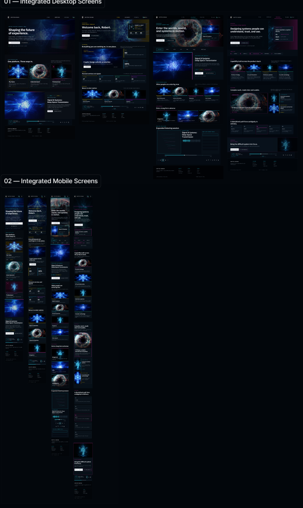

# CrypticDesign.net Visual Direction — Integrated Screens

Owner: Robert Croft  
Submitted: 2026-07-12  
Status: Approved direction for the next implementation session  
Applies to: CrypticDesign.net desktop and mobile frontend

## Source reference

## Direction captured

- Dark, cinematic interface with deep navy-black surfaces and restrained borders.
- Cyan, electric blue, magenta, and gold accents distinguish platform lanes and states.
- Large atmospheric artwork anchors each front door without replacing clear information hierarchy.
- Desktop layouts use dense but disciplined editorial grids, feature panels, metrics, and media controls.
- Mobile layouts preserve the same hierarchy through stacked cards and compact navigation.
- My Home emphasizes the member's character, progression, interests, library, and activity.
- Entertainment is the audience-facing hub for releases, franchises, categories, playback, and interactive content.
- Professional is the Cryptic Design LLC front door for services, collaborations, capabilities, and inquiry.

## Next-session implementation intent

Translate this reference into the existing v14 information architecture and responsive Next.js frontend. Preserve current route behavior, governance checks, contextual product flow, and preview-only backend boundaries while replacing the placeholder visual language with this integrated system.

## Guardrails

- Visual direction does not authorize production publishing, backend implementation, payments, or external asset use without rights review.
- Use owned or placeholder-safe imagery until final assets pass `isPubliclyRenderable` governance.
- Maintain mobile and desktop parity and WCAG-conscious contrast and interaction states.
